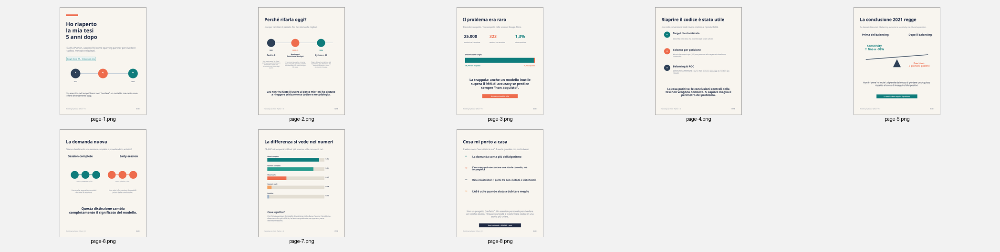

# Google Store Thesis Revisited

> **R in 2021. Python + AI in 2026. Same dataset, better questions.**

In 2021 I completed my Master's thesis in Management Economics on **machine learning for online purchase prediction**, using Google Store session data and implementing the analysis in **R**.

More than five years later, I reopened the thesis, the dataset and my old scripts as a personal side project: not to turn it into a production system, but to see what still holds, what I would change today, and how Python and AI-assisted code review affect the way I approach the same problem.



## What the original project studied

The analysis used a random sample of **25,000 sessions** from a much larger Google Store dataset. Only **323 sessions (1.29%)** ended with a purchase, making this a strongly imbalanced binary-classification problem.

The original thesis compared **Logistic Regression, LDA and SVM**, together with **SMOTE, ROSE and MWMOTE**, using sensitivity, specificity, precision, F1, accuracy and ROC-AUC.

## Why revisit it?

The 2021 work was developed in R. Revisiting it in Python made it possible to separate three questions:

1. **Can the old workflow be reproduced?**
2. **Which conclusions survive a stricter validation pipeline?**
3. **Are we predicting a purchase early, or mostly recognizing a session after observing its full behaviour?**

AI was used as a **review and reasoning aid**: reconstructing old scripts, finding inconsistencies, challenging methodological choices and comparing alternative implementations. The reported results come from executed code in the notebooks.

## Key findings

### 1. Accuracy is still a trap

A classifier that predicts **no purchases at all** reaches **98.46% accuracy** on the temporal holdout, with **0% sensitivity**.

### 2. Strong discrimination survives a leakage-free pipeline — when the full session is known

| Model | ROC-AUC | PR-AUC | Sensitivity | Precision |
|---|---:|---:|---:|---:|
| Logistic Regression | 0.984 | 0.404 | 0.948 | 0.227 |
| LDA | 0.962 | 0.370 | 0.844 | 0.202 |
| SVM | 0.980 | 0.373 | 0.961 | 0.211 |

So the strong discrimination seen in the thesis was **not explained only by the original scaling-before-split leakage**.

### 3. Without `hits` and `pageviews`, the question becomes much harder

| Model | ROC-AUC | PR-AUC |
|---|---:|---:|
| Logistic Regression | 0.717 | 0.036 |
| LDA | 0.730 | 0.036 |
| SVM | 0.709 | 0.039 |

This reframes the original task: the thesis models were very good at **classifying a session using behaviour observed during the session**; predicting the purchase much earlier is a different and substantially harder problem.

### 4. Qualitative variables matter much more in the early-session scenario

Adding source, channel, browser, operating system and geography to the early-session Logistic Regression raises performance to:

- **ROC-AUC: 0.875**
- **PR-AUC: 0.167**

### 5. Threshold selection is part of the decision

Cross-validated threshold tuning on the session-complete mixed Logistic Regression produced **F1 = 0.491**, with precision **0.465** and sensitivity **0.519**.

## 2021 vs 2026

| Aspect | 2021 thesis | 2026 revisit |
|---|---|---|
| Language | R | Python |
| Split | Random 80/20 | Temporal holdout |
| Scaling | Before split | Fit only on training/folds |
| Balancing | Pre-generated sets | Inside CV pipeline |
| SMOTE ratio | Fixed | Tuned |
| SVM parameters | Fixed | Cross-validated |
| Evaluation | ROC + confusion metrics | PR-AUC + ROC + confusion metrics |
| Threshold | Mainly 0.5 | Tuned on training |
| Feature timing | Session-complete | Complete vs early-session |
| Reproducibility | Sequential R scripts | Executable Python notebooks |

## Repository structure

```text
google-store-thesis-revisited/
├── README.md
├── requirements.txt
├── .gitignore
├── data/
│   └── README.md
├── notebooks/
│   ├── 00_project_overview.ipynb
│   ├── 01_cleaning_eda.ipynb
│   ├── 02_thesis_reproduction.ipynb
│   └── 03_2026_revision.ipynb
├── html/
│   ├── 00_project_overview.html
│   ├── 01_cleaning_eda.html
│   ├── 02_thesis_reproduction.html
│   └── 03_2026_revision.html
├── slides/
│   ├── thesis_revisited_linkedin_carousel.pdf
│   └── thesis_revisited_linkedin_carousel.pptx
└── assets/
    └── carousel-preview.png
```

## Notebooks

- **[00 — Project overview](notebooks/00_project_overview.ipynb)**: short narrative and key results.
- **[01 — Cleaning & EDA](notebooks/01_cleaning_eda.ipynb)**: Python reconstruction of data preparation and exploratory analysis.
- **[02 — Thesis reproduction](notebooks/02_thesis_reproduction.ipynb)**: Logistic Regression, LDA, SVM and historical balancing logic.
- **[03 — 2026 revision](notebooks/03_2026_revision.ipynb)**: temporal validation, leakage-free pipelines, tuning, PR-AUC, threshold selection and early-session analysis.

## Rendered HTML snapshots

The repository also includes static HTML exports with all saved outputs, charts and explanations:

- **[00 — Project overview (HTML)](html/00_project_overview.html)**
- **[01 — Cleaning & EDA (HTML)](html/01_cleaning_eda.html)**
- **[02 — Thesis reproduction (HTML)](html/02_thesis_reproduction.html)**
- **[03 — 2026 revision (HTML)](html/03_2026_revision.html)**

> GitHub stores these HTML files as source files. They can be downloaded and opened locally; they can also be published as browsable pages later using GitHub Pages.

## Reproducing the analysis

1. Clone the repository.
2. Put the sample CSV in `data/Data_Frame_Gstore_sample.csv`.
3. Install dependencies:

```bash
pip install -r requirements.txt
```

4. Open the notebooks in Jupyter.

## Important note on ROSE and MWMOTE

The historical thesis used R packages for ROSE and MWMOTE. There is no 1:1 standard Python implementation used in this environment, so the historical reproduction notebook labels transparent approximations as **ROSE-like** and **MWMOTE-like**. They are not presented as numerically identical replacements.

## Scope

This is a **personal learning / retrospective project**, not a production-ready purchase-prediction system.

The most useful outcome was not a higher score. It was returning to the same dataset after several years and asking **better questions** about validation, feature availability, imbalance and what the model is actually predicting.
